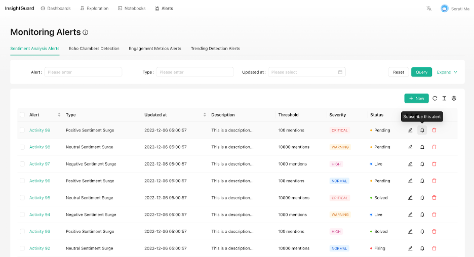

# Social Media Insights Workplace

A powerful platform for analyzing and visualizing social media data, providing insights through interactive dashboards and real-time analytics.

> Note: This project is currently in the prototype phase, focusing on design and user experience. It is not yet production-ready and should be used for demonstration purposes only.

## Features

- 📊 Interactive Data Visualization
  - Custom chart builder
  - User engagement heat maps
  - Real-time analytics dashboards
  - Interactive charts and graphs

- 📱 Social Media Monitoring
  - Real-time social media data tracking
  - Custom alerts and notifications
  - Trend analysis and insights
  - User engagement metrics

- 📓 Notebook System
  - Fullscreen notebook interface
  - Save and organize insights
  - Collaborative workspace
  - Customizable dashboards

- 👥 User Management
  - Admin user settings
  - Role-based access control
  - User activity tracking
  - Quick start guides

## Project Structure

```
social-media-insights-workplace/
├── ui/                 # Frontend React application
├── observable/         # Observable framework integration
├── scripts/           # Utility scripts
└── images/            # Project screenshots and assets
```

## UI Screenshots

### Welcome & Overview


*Welcome screen with quick access to key features*


*Main overview dashboard showing key metrics and insights*

### Data Visualization


*Interactive chart builder for custom visualizations*


*Dynamic and interactive chart displays*


*Heat map visualization of user engagement patterns*

### Monitoring & Alerts


*Alert management interface*


*Detailed view of specific alerts and notifications*

### Notebook System


*Fullscreen notebook interface for detailed analysis*


*Collection of saved notebooks and analyses*

### Admin & Settings


*User management and settings interface*


*Quick start guide for administrators*

### Design Evolution


*Initial low-fidelity design concept*


*Refined low-fidelity design iteration*

### Example Dashboards


*Dashboard focused on mask-related social media insights*


*Comparative analysis dashboard*

## Future Work

- Enhanced data visualization capabilities:
  - Integration with D3.js
  - ECharts implementation
  - Advanced charting libraries
- Observable framework integration
- Docker Compose setup for easy deployment
- Deployment documentation and guides
- Additional social media platform integrations
- Real-time collaboration features
- Advanced analytics and machine learning capabilities
